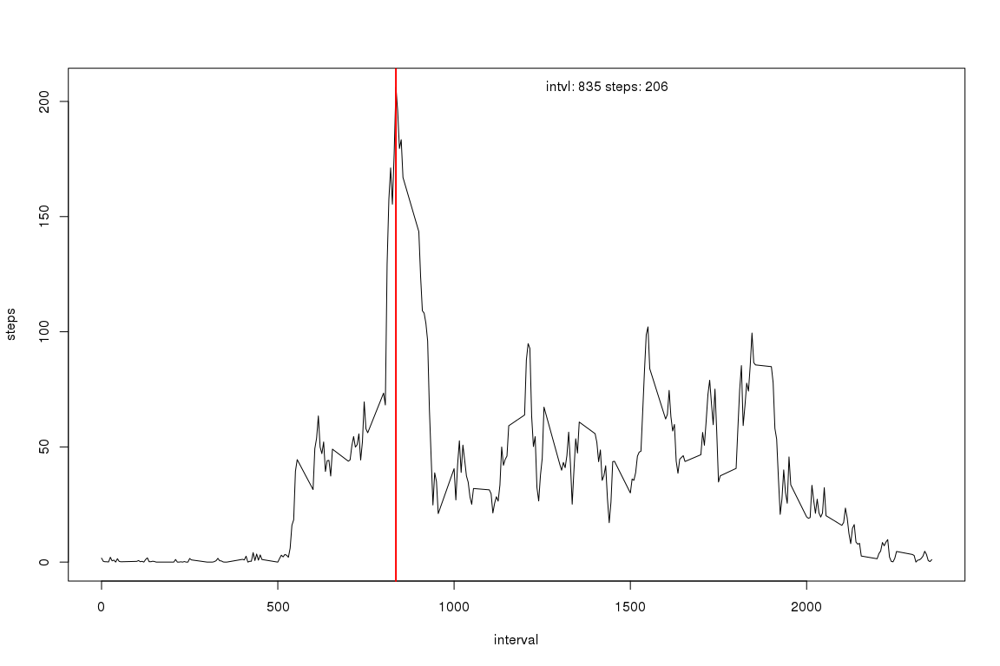

# Activity Analysis
Chris Njuguna  
July 21, 2016  

###Read in the data and convert the dates from characters to date objects


###What is mean total number of steps taken per day?


```r
#calculate the mean number of steps taken for each day
mean_daily_steps <- tapply(X=activity$steps, INDEX = activity$date, FUN=mean, na.rm=TRUE)
```

A histogram of the number of steps taken each day is shown below


```r
hist(mean_daily_steps)
```

<!-- -->

The mean number of total steps per day is 37.3825996 while the median is 37.3784722

###What is the average daily activity pattern?

A timeseries plot of the average of the 5-minute intervals across all days


```r
mean_5min_intervals <- tapply(X=activity$steps, INDEX = activity$interval, FUN=mean, na.rm=TRUE)
plot(seq(0, 1435, by = 5), mean_5min_intervals, type="l", xlab = "5 min intervals", ylab = "Mean steps")
```

<!-- -->

```r
#calculate the max steps
max_mean_5min_intervals <- max(mean_5min_intervals,na.rm=TRUE)

#find the index with the highest number of steps
idx_max_mean_5min_intervals <- which(mean_5min_intervals == max_mean_5min_intervals)
max_intvl <- idx_max_mean_5min_intervals*5
```
The 5 min interval with the highest number of steps is 520 with 206.1698113 steps.

###Imputing missing values


```r
num_NA <- sum(is.na(activity))

#calculate the mean across all steps
mean_all_intervals <- mean(activity$steps, na.rm=TRUE)

#copy the activity dataset
activity_noNA <- activity

#replace all NAs with the mean across all steps
activity_noNA[is.na(activity_noNA$steps),"steps"] <- mean_all_intervals

mean_5min_intervals_noNA <- tapply(X=activity_noNA$steps, INDEX = activity_noNA$interval, FUN=mean, na.rm=TRUE)
```

A histogram of the number of steps taken each day with imputed data is shown below


```r
hist(mean_5min_intervals_noNA)
```

<!-- -->

There is a great change in the distribution of the steps. The imputed data displays a strong right skew while the data with NAs is almost normally distributed.

The mean number of total steps per day is 37.3825996 while the median is 34.5419803

###Are there differences in activity patterns between weekdays and weekends?


```r
activity$wkday <- sapply(weekdays(activity$date, abbreviate = TRUE), FUN = function(x) if (x == "Sat" | x == "Sun") {"weekend"} else {"weekday"})

activity$wkday <- as.factor(activity$wkday)

wkdays <- which(activity$wkday == "weekday")
wkends <- which(activity$wkday == "weekend")


wkdays <- which(activity$wkday == "weekday")
wkends <- which(activity$wkday == "weekend")

weekday_means <- tapply(X=activity[wkdays,]$steps, INDEX = activity[wkdays,]$interval, FUN=mean, na.rm=TRUE)

weekend_means <- tapply(X=activity[wkends,]$steps, INDEX = activity[wkends,]$interval, FUN=mean, na.rm=TRUE)

par(mfrow=c(1,2))

rng <- range(weekday_means, weekend_means)

plot(seq(0, 1435, by = 5), weekday_means, type="l", ylim=rng, xlab = "5 min intervals", ylab = "Mean steps", sub = "weekday")

plot(seq(0, 1435, by = 5), weekend_means, type="l", ylim=rng, xlab = "5 min intervals", ylab = "Mean steps", sub = "weekend")

title(main="Average steps per interval", outer = TRUE)
```

<!-- -->

There are differences between weekday and weekend activity. There is a slower start to activity on the weekend which culminates in higher volumes in the middle of the day than weekdays. Weekdays however have a higher maximum number of steps early in the day.
